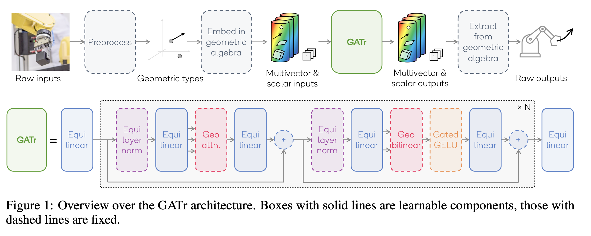
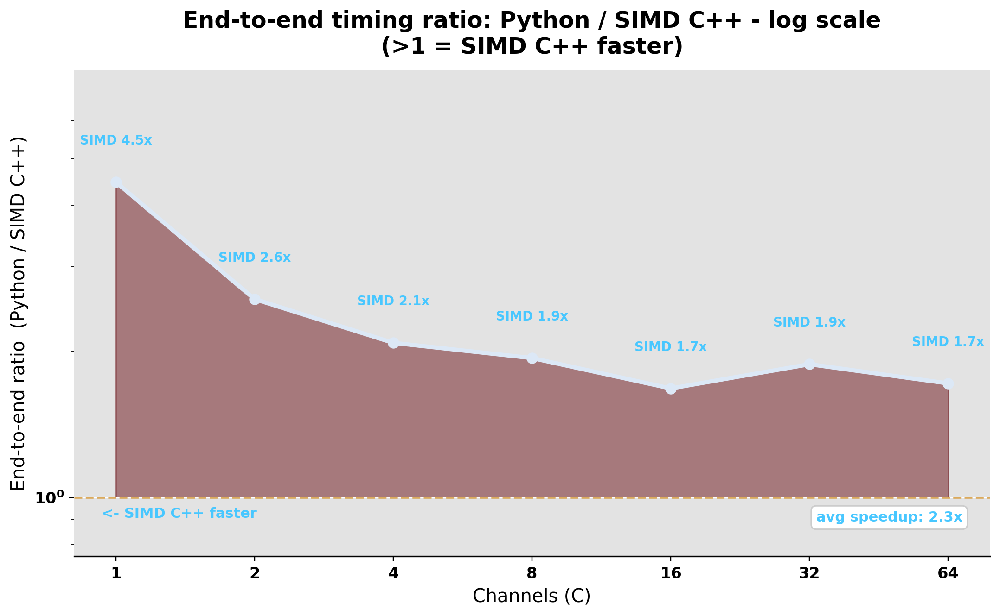
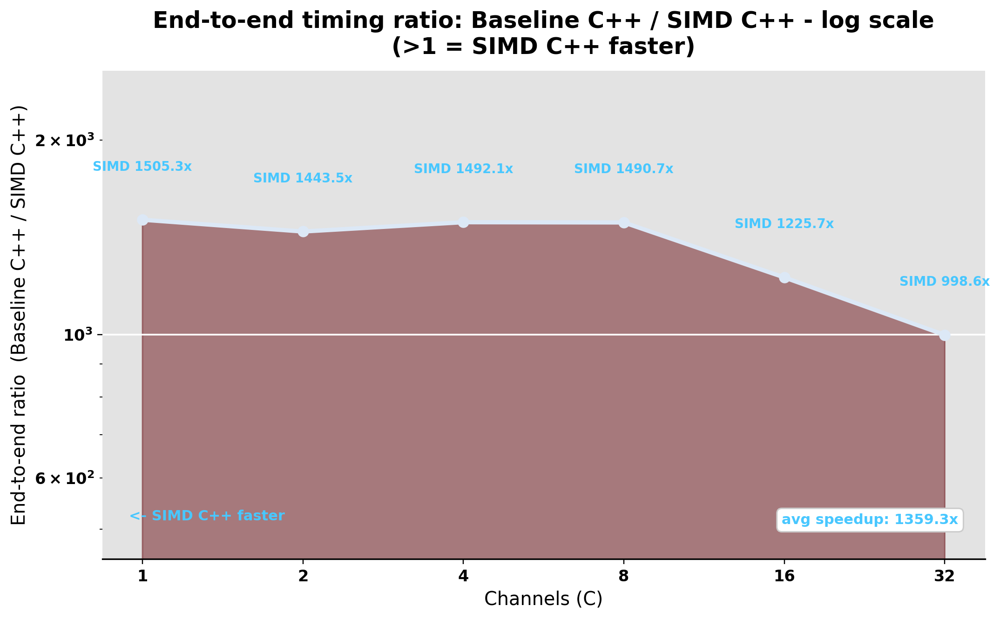

# FASTGATr: An Optimized Easy Geometric Algebra Transformer

FASTGatR is a single-core optimized implementation of the core operations in the **Geometric Algebra Transformer (GATr)**.

GATr processes 3D geometric data using 16-dimensional multivectors from projective geometric algebra. For this project, we treat GATr primarily as a **structured computation problem**: rather than changing the model, we optimize the repeated low-level operations used throughout its forward pass.



Our starting point is **EzGATr (Easy Geometric Algebra Transformer)**, a readable PyTorch implementation that we use as both a reference and correctness oracle. We reimplement six core operations in C++ and optimize them by exploiting sparsity, improving data layout, reducing intermediate work, and applying ARM NEON SIMD vectorization. The report shows final speedups of up to **1500× over the straightforward C++ baseline** and **1.7–4.5× over the current state of the art: EzGATr**.

## Core Operations

We optimize the following functions:

* <span style="color:#1f77b4">`EquiLinear`</span>: equivariant linear layer for multivector features.
* <span style="color:#ff7f0e">`EquiRMSNorm`</span>: RMS normalization adapted to equivariant features.
* <span style="color:#2ca02c">`geometric_product`</span>: core bilinear geometric algebra operation.
* <span style="color:#d62728">`equi_join`</span>: equivariant join for combining geometric entities.
* <span style="color:#9467bd">`equi_geometric_attention`</span>: geometry-aware attention.
* <span style="color:#17becf">`scalar_gated_gelu`</span>: gated GELU activation for scalar channels.


## Results

Exploiting the sparse algebraic structure provides the largest performance gain. The SIMD implementation outperforms EzGATr across all tested sizes.

At the largest tested size, approximate per-kernel speedups over the C++ baseline are:

| Kernel              | Scalar |   SIMD |
| ------------------- | -----: | -----: |
| `EquiLinear`        |  ~890× | ~2378× |
| `geometric_product` |  ~161× |  ~276× |
| `equi_join`         |  ~203× |  ~258× |
| attention           |    ~4× |    ~8× |

`EquiRMSNorm` and gated GELU gain less because they are already simple streaming kernels.


## Optimization Approach

The main opportunity comes from the fact that GATr's fixed structure tensors are highly sparse. Dense implementations evaluate many zero-valued terms, while the optimized kernels compute only the nonzero interactions.

| Kernel              | Dense terms | Nonzero terms |
| ------------------- | ----------: | ------------: |
| `EquiLinear`        |        2304 |            24 |
| `geometric_product` |        4096 |           192 |
| `equi_join`         |        4096 |            81 |

For `EquiLinear`, folding the fixed basis factors into the weights gives an algorithmic reduction of roughly **140×** in weighted operation count.

The optimization pipeline includes:

* sparse specialization of fixed structure tensors
* generated kernels for geometric product and join
* independent accumulators to improve instruction-level parallelism
* scalar replacement to keep reused blades in registers
* algebraic simplification and fusion in geometric attention
* packed `EquiLinear` weights for better locality
* explicit 128-bit ARM NEON vectorization

For `EquiLinear`, weights are repacked from:

```text
[C_out, C_in, 9]
```

to:

```text
[C_in, C_out, 9]
```

so coefficients are contiguous in the order used by the optimized inner loop.

## SIMD Strategy

Different kernels use different vectorization axes:

* `EquiLinear` and `EquiRMSNorm` vectorize across compatible blade groups within one multivector.
* `geometric_product` and `equi_join` vectorize across the batch dimension.
* geometric attention vectorizes across channels.

The implementation uses ARM NEON intrinsics such as:

```cpp
vfmaq_n_f32(...)
```

to process four `float32` values per instruction.

## Speed-up Ratio per size

The SIMD implementation reaches up to approximately **1500× end-to-end speedup** over the straightforward C++ baseline.

<p align="center">
  
  
</p>

Compared with the current state of the art model, FASTGATr achieves approximately **1.7–4.5× end-to-end speedup**.

The optimized scalar builds sustain roughly **11–15 GFLOP/s**, while the SIMD version reaches approximately **27–32 GFLOP/s**, with a peak of about **32 GFLOP/s**, or 36% of the measured single-core NEON peak.

## Performance Limits

After the redundant arithmetic is removed, the main limitation becomes **memory traffic** rather than compute throughput.

Attention remains relatively expensive because its score, softmax, and value-accumulation passes are memory-bound. The report's cache-aware roofline analysis therefore suggests that future work should focus on:

* additional operator fusion
* blocking across operators
* reducing intermediate data movement
* increasing data reuse

rather than simply adding more SIMD.

## Build Output

The compiled C++ extension modules are built into:

```text
Code/python/ops/
```

Temporary compiler files are stored in:

```text
Code/python/build/
```

The `Code/python/build/` folder and compiled `.so` files should not be committed.

Generated experiment artifacts are kept outside `Code/`:

```text
Results/timing_results/
Results/profiling/
Results/disassembly/
Results/logs/
```

## References

We use the following paper as the main GATr reference:

Brehmer, J., de Haan, P., Behrends, S. and Cohen, T.S., 2023. **Geometric Algebra Transformer.** *Advances in Neural Information Processing Systems*, 36, pp. 35472–35496.

Pages 3–7 and Appendix B define the core operations used in this project, including the geometric product, equivariant linear maps, geometric attention, join, gated nonlinearity, and normalization.

We use **EzGATr** as the PyTorch reference implementation and correctness oracle.
